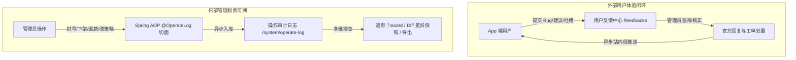

# 用户反馈中心与操作审计日志系统设计与对接规范

本文档针对后端（基于 `JDK 17 + Spring Cloud + MyBatis-Plus`）现有已实现的接口契约与数据模型，系统性梳理并设计 **「用户意见反馈中心」** 与 **「操作审计日志系统」** 的前端功能架构、状态流转机、界面规划及前后端通信协议，供后续开发与联调对照使用。

---

## 目录

- [一、业务背景与双翼治理定位](#一业务背景与双翼治理定位)
- [二、用户反馈与建议中心 (User Feedback)](#二用户反馈与建议中心-user-feedback)
  - [2.1 后端现有接口与状态机](#21-后端现有接口与状态机)
  - [2.2 接口契约参数与响应模型](#22-接口契约参数与响应模型)
  - [2.3 业务异常与错误码对照](#23-业务异常与错误码对照)
  - [2.4 前端界面与交互功能设计](#24-前端界面与交互功能设计)
- [三、操作审计日志与行为追踪 (Operation Audit Log)](#三操作审计日志与行为追踪-operation-audit-log)
  - [3.1 后端现有接口与 AOP 架构](#31-后端现有接口与-aop-架构)
  - [3.2 审计日志核心字段与元数据模型](#32-审计日志核心字段与元数据模型)
  - [3.3 登录审计日志扩展 (Login Log)](#33-登录审计日志扩展-login-log)
  - [3.4 前端界面与交互功能设计](#34-前端界面与交互功能设计)
- [四、前端 TypeScript 契约模型设计草案](#四前端-typescript-契约模型设计草案)
  - [4.1 用户反馈模型 (`src/types/feedback.ts`)](#41-用户反馈模型-srctypesfeedbackts)
  - [4.2 审计日志模型 (`src/types/audit.ts`)](#42-审计日志模型-srctypesauditts)
- [五、导航菜单、权限矩阵与实施路线图](#五导航菜单权限矩阵与实施路线图)

---

## 一、业务背景与双翼治理定位

在 UGC 社区与社交内容平台的生命周期中，管理后台需要兼顾 **“外部用户体验闭环”** 与 **“内部管理权责追溯”**：



1. **用户反馈中心**：作为 App 客户端与平台运营之间的直通桥梁，收集用户的使用问题、优化建议与客诉，提供官方回复、状态流转与即时通知。
2. **操作审计日志**：作为合规安全监管与内部管理的“黑匣子”，全量沉淀管理员对敏感业务（封禁用户、驳回申诉、下架动态、热修改告警阈值等）的操作痕迹、变更前后对比及分布式追踪 ID。

---

## 二、用户反馈与建议中心 (User Feedback)

后端已在 `yudao-module-feeds` 模块中合入了完整的反馈业务能力（对应控制器 `AdminFeedsFeedbackController.java` 与 `AppFeedsFeedbackController.java`）。

### 2.1 后端现有接口与状态机

#### 1. 控制器端点清单 (`/admin-api/feeds/feedback`)

| 端点路径 | HTTP 方法 | 功能描述 | 权限标识 | 对应后端方法 |
| :--- | :--- | :--- | :--- | :--- |
| `/admin-api/feeds/feedback/summary` | `GET` | 反馈核心 KPI 统计概览 | `feeds:feedback:query` | `getFeedbackSummary()` |
| `/admin-api/feeds/feedback/page` | `GET` | 反馈工单多维分页列表 | `feeds:feedback:query` | `getFeedbackPage()` |
| `/admin-api/feeds/feedback/get` | `GET` | 反馈工单全量明细（传 `id`） | `feeds:feedback:query` | `getFeedback()` |
| `/admin-api/feeds/feedback/handle` | `PUT` | 官方回复/处理工单 | `feeds:feedback:handle` | `handleFeedback()` |

#### 2. 工单状态机流转 (`status`)

| 状态编码 | 状态名称 | 视觉标签 | 状态说明 | 允许触发的动作 |
| :--- | :--- | :--- | :--- | :--- |
| `pending` | **待处理** | `warning` (橙色) | 用户在 App 端刚提交，等待管理员首次跟进 | `reply` (回复并完结), `close` (直接关闭) |
| `processing` | **处理中** | `processing` (蓝色) | 管理员已标记跟进排查中 | `reply`, `close` |
| `resolved` | **已处理** | `success` (绿色) | 管理员已填写官方答复，工单圆满闭环 | — (仅供查阅) |
| `closed` | **已关闭** | `default` (灰色) | 属于重复反馈、恶意刷屏或无效反馈，已关闭归档 | — (仅供查阅) |

#### 3. 反馈类型枚举 (`feedbackType`)

- `suggestion`：**功能建议**（界面改版、新玩法、优化提议）
- `bug`：**系统缺陷**（闪退、白屏、按钮无响应、网络报错）
- `complaint`：**违规投诉**（针对内容、活动或其它用户的维权与体验问题）
- `other`：**其它反馈**

---

### 2.2 接口契约参数与响应模型

#### 1. 统计概览 (`GET /admin-api/feeds/feedback/summary`)
- **响应数据示例**：
  ```json
  {
    "code": 0,
    "msg": "",
    "data": {
      "pendingCount": 12,
      "processingCount": 5,
      "resolvedCount": 128,
      "closedCount": 16,
      "todayNewCount": 7
    }
  }
  ```

#### 2. 分页查询 (`GET /admin-api/feeds/feedback/page`)
- **请求 Query 参数**：
  - `pageNo`：当前页码（从 1 开始，默认 1）
  - `pageSize`：每页条数（默认 10 / 20）
  - `status`（可选）：状态过滤（`pending` / `processing` / `resolved` / `closed`）
  - `feedbackType`（可选）：类型过滤（`suggestion` / `bug` / `complaint` / `other`）
  - `userId`（可选）：反馈用户 ID
  - `createTime`（可选）：创建时间范围（`[开始时间, 结束时间]`）
- **响应数据示例**：
  ```json
  {
    "code": 0,
    "msg": "",
    "data": {
      "list": [
        {
          "id": 10086,
          "userId": 5288192038103,
          "feedbackType": "bug",
          "content": "活动详情页在 iOS 18 系统下点击报名按钮偶发白屏，退出后重新进入恢复正常。",
          "imageUrls": "https://oss.qxj.com/feedbacks/2026/09/shot1.png,https://oss.qxj.com/feedbacks/2026/09/shot2.png",
          "contactInfo": "微信号: travel_leo / 手机号: 13800138000",
          "status": "pending",
          "adminReply": null,
          "handlerUserId": null,
          "handledAt": null,
          "createdAt": "2026-09-10 14:30:00",
          "updatedAt": "2026-09-10 14:30:00"
        }
      ],
      "total": 161
    }
  }
  ```

#### 3. 处理反馈 (`PUT /admin-api/feeds/feedback/handle`)
- **请求 Body 参数**：
  ```json
  {
    "id": 10086,
    "action": "reply",
    "adminReply": "感谢反馈！我们已定位到与 iOS 18 WebKit 渲染兼容相关的问题，已在 v2.4.1 版本修复上线，请更新体验。",
    "notifyUser": true
  }
  ```
- **字段说明**：
  - `id` (Long, 必填)：反馈 ID
  - `action` (String, 必填)：`reply`（回复并标记为 `resolved`）或 `close`（关闭归档为 `closed`）
  - `adminReply` (String, 当 action=reply 时必填，1~2000字)：官方处理结论
  - `notifyUser` (Boolean, 选填，默认 false)：`true` 时后端将在事务提交后异步给用户 App 推送站内通知信

---

### 2.3 业务异常与错误码对照

后端统一使用 `1-006-006-xxx` 错误码体系：

| 错误码 | 常量名 | 触发场景 | 前端推荐交互提示 |
| :--- | :--- | :--- | :--- |
| `1006006026` | `FEEDBACK_CONCURRENT_CONFLICT` | 并发处理冲突，已被其它管理员处理 | 弹窗提示“该工单刚刚已被其他管理员处理，列表已自动刷新”并重刷列表 |
| `1006006027` | `FEEDBACK_ACTION_INVALID` | 提交的 action 非 `reply` 或 `close` | 提示“非法的处理动作” |
| `1006006028` | `FEEDBACK_REPLY_EMPTY` | 回复内容为空或超过 2000 字限制 | 表单即时校验“回复内容不能为空且不能超过2000字” |

---

### 2.4 前端界面与交互功能设计

针对该模块，前端页面规划为 **「用户反馈管理 (`/feedbacks`)」**：

1. **顶部 5 大 KPI 态势卡片**：
   - 待处理工单（高亮警示色）、今日新增、处理中、已解决、已关闭；
2. **多维防抖检索栏**：
   - 状态 Segmented / Tabs 快捷切换（全部、待处理、已处理、已关闭）；
   - 反馈类型下拉框（Bug 缺陷、功能建议、投诉举报等）；
   - 用户 UID / 手机号精准搜索；
   - 提交时间区间日期选择器；
3. **高密度列表与画廊缩略**：
   - 展示反馈类型 Tag、用户基本信息、精简问题文本；
   - 截图画廊缩略图组（点击唤起 AntD `Image.PreviewGroup`，支持原地旋转、缩放、轮播翻看多图）；
   - 联系方式一键复制功能；
4. **反馈工单详情与处置抽屉 (`FeedbackDetailDrawer`)**：
   - **左侧/上部**：用户画像简报（头像、昵称、历史提交反馈数）、反馈原始完整内容、高清图片列表、联系渠道；
   - **右侧/下部**：官方回复工作区
     - **常用回复快捷模板**（如：“已知晓将在下个版本修复”、“感谢优质建议，已采纳”、“请提供更具体的复现录屏”）；
     - 富文本/文本域输入框（带实时字符数统计）；
     - 动作单选（【回复并解决】/【关闭工单】）；
     - 勾选框：**“通过 App 站内信通知用户”**（对应 `notifyUser=true`）。

---

## 三、操作审计日志与行为追踪 (Operation Audit Log)

后端在 `yudao-module-system` 中内置了工业级的操作审计日志中心（基于 AOP 自动拦截并在异步线程中批处理入库 `system_operate_log` 表）。

### 3.1 后端现有接口与 AOP 架构

#### 1. 控制器端点清单 (`/admin-api/system/operate-log`)

| 端点路径 | HTTP 方法 | 功能描述 | 权限标识 | 对应后端方法 |
| :--- | :--- | :--- | :--- | :--- |
| `/admin-api/system/operate-log/page` | `GET` | 分页查询全量操作审计日志 | `system:operate-log:query` | `pageOperateLog()` |
| `/admin-api/system/operate-log/export` | `GET` | 导出操作日志为 Excel 文件流 | `system:operate-log:export` | `exportOperateLog()` |

#### 2. 切面自动捕获机制
后端通过 `@OperateLog` 注解实现自动化审计：
- 自动提取当前登录管理员账号（`userId`）、昵称（`userName`）；
- 自动抓取 Spring Web 线程上下文的 `traceId`（基于 SkyWalking / OpenTelemetry 链路标准）；
- 自动记录操作模块（`type`，如“用户”、“内容”、“活动”）、子操作（`subType`，如“封禁”、“审核通过”）；
- 自动对修改前后的 POJO 序列化生成语义化 `action` 描述与 `extra` 差异对比 JSON。

---

### 3.2 审计日志核心字段与元数据模型

数据模型映射自后端 [`OperateLogRespVO.java`](file:///home/panda/code/qxj-yudao-mini-jdk17-agent/yudao-module-system/yudao-module-system-biz/src/main/java/com/qxjapp/module/system/controller/admin/logger/vo/operatelog/OperateLogRespVO.java)：

| 字段名 | 类型 | 说明 | 业务排查与前端呈现价值 |
| :--- | :--- | :--- | :--- |
| `id` | `Long` | 日志主键自增 ID | 唯一定位单次操作记录 |
| `traceId` | `String` | 全局分布式链路跟踪编号 | **跨模块排查核心键**：可一键复制并联动跳转至运维错误日志 (`/ops/logs`) |
| `userId` | `Long` | 操作人管理员 ID | 溯源责任人 |
| `userName` | `String` | 操作人昵称/账号名 | 列表直观呈现操作人名片 |
| `type` | `String` | 操作模块类型 (如“用户”, “活动”) | 分类筛选与图标区分 |
| `subType` | `String` | 操作名 (如“封禁用户”, “驳回申诉”) | 精准动作识别 |
| `bizId` | `Long` | 目标业务实体编号 | 对应被修改的用户 ID、动态 ID 或活动 ID，支持点击跳转 |
| `action` | `String` | 语义化操作详细描述 | 如“将用户 [1001] 状态从 [正常] 变更为 [封禁]，持续时间 7 天” |
| `extra` | `String` | 拓展 JSON（差异快照或入参详情） | 支持在前端通过 Monaco / JSON Diff 视图展示前后变更 |
| `requestMethod`| `String` | HTTP 请求方法 (`POST`/`PUT`/`DELETE`) | 辅助标识读写安全性 |
| `requestUrl` | `String` | 实际请求 URI 路径 | 还原接口调用上下文 |
| `userIp` | `String` | 操作人来源 IPv4/IPv6 | 溯源操作地与内网终端 |
| `userAgent` | `String` | 浏览器 UA 标识 | 识别操作端环境（Chrome、Edge、自动化脚本等） |
| `createTime` | `String` | 操作发生时间 | 精确到秒的时间戳 |

---

### 3.3 登录审计日志扩展 (Login Log)

在同模块下，后端还提供了配套的 **登录日志端点 (`/admin-api/system/login-log`)**：
- 端点：`GET /admin-api/system/login-log/page` 与 `GET /admin-api/system/login-log/export`；
- 专职记录管理员登录历史：账号名、登录 IP、地理归属地、操作系统、浏览器类型、登录结果（成功 / 账号密码错误 / 验证码失效）及登录时间；
- 可与操作日志形成**安防双日志矩阵**。

---

### 3.4 前端界面与交互功能设计

前端页面规划为 **「操作审计日志 (`/system/operate-logs` 或 `/ops/operate-logs`)」**：

1. **双视图模式切换**：
   - **标准表格视图**：适合高密度快速浏览、多列排序与批量导出；
   - **时间线流水视图 (Timeline)**：按日期倒序呈现操作轴，带有生动的时间标记与头像。
2. **智能联动与穿梭导航 (Cross-Navigation)**：
   - **TraceId 一键穿梭**：点击 `traceId` 旁边的小图标，自动带参跳转至 `/ops/logs` 检索当次请求在后端网关与微服务中打印的错误堆栈；
   - **BizId 业务实体穿梭**：如果 `type` 是“用户”，点击 `bizId` 直接展开该用户的合规档案抽屉；如果是“活动”，直接展开活动全景抽屉。
3. **数据变更 Diff 对比抽屉 (`OperateLogDiffDrawer`)**：
   - 当日志含有 `extra` 字段时，操作栏提供「查看变更快照」按钮；
   - 抽屉内渲染高质感代码差异对比（绿色高亮新增项，红色高亮移除项，直观查看改动前后属性值）。
4. **安全导出与脱敏机制**：
   - 导出按钮调用后端 `/admin-api/system/operate-log/export` 接口，自动下载标准 `.xlsx` 报表；
   - 管理员手机号或 IP 可根据权限决定是否脱敏。

---

## 四、前端 TypeScript 契约模型设计草案

### 4.1 用户反馈模型 (`src/types/feedback.ts`)

```typescript
/**
 * 反馈分类枚举
 */
export type FeedbackType = 'suggestion' | 'bug' | 'complaint' | 'other';

/**
 * 反馈工单生命周期状态
 */
export type FeedbackStatus = 'pending' | 'processing' | 'resolved' | 'closed';

/**
 * 后端响应 VO
 */
export interface AdminFeedsFeedbackRespVO {
  id: number;
  userId: number;
  feedbackType: FeedbackType;
  content: string;
  imageUrls?: string; // 逗号分隔 URL
  contactInfo?: string;
  status: FeedbackStatus;
  adminReply?: string;
  handlerUserId?: string;
  handledAt?: string;
  createdAt: string;
  updatedAt: string;
}

/**
 * 前端视图层模型
 */
export interface FeedbackItem {
  id: string;
  numericId: number;
  userId: string;
  userNickname?: string;
  userAvatar?: string;
  type: FeedbackType;
  content: string;
  images: string[];
  contactInfo: string;
  status: FeedbackStatus;
  adminReply?: string;
  handlerId?: string;
  handledAt?: string;
  createdAt: string;
}

/**
 * 统计概览模型
 */
export interface FeedbackSummaryStats {
  pendingCount: number;
  processingCount: number;
  resolvedCount: number;
  closedCount: number;
  todayNewCount: number;
}

/**
 * 处理工单请求参数
 */
export interface HandleFeedbackParams {
  id: number;
  action: 'reply' | 'close';
  adminReply?: string;
  notifyUser?: boolean;
}
```

---

### 4.2 审计日志模型 (`src/types/audit.ts`)

```typescript
/**
 * 操作审计日志 Response VO
 */
export interface OperateLogRespVO {
  id: number;
  traceId: string;
  userId: number;
  userName: string;
  type: string;
  subType: string;
  bizId?: number;
  action: string;
  extra?: string; // JSON 字符串
  requestMethod: string;
  requestUrl: string;
  userIp: string;
  userAgent: string;
  createTime: string;
}

/**
 * 操作日志分页查询参数
 */
export interface OperateLogQueryParams {
  pageNo: number;
  pageSize: number;
  userId?: number;
  bizId?: number;
  type?: string;
  subType?: string;
  action?: string;
  createTime?: [string, string];
}

/**
 * 登录日志 Response VO
 */
export interface LoginLogRespVO {
  id: number;
  logType: number;
  userId: number;
  userType: number;
  username: string;
  userIp: string;
  userAgent: string;
  result: number; // 0=成功，1=失败
  createTime: string;
}
```

---

## 五、导航菜单、权限矩阵与实施路线图

### 1. 推荐菜单挂载结构

根据本项目现行的菜单体系结构，推荐挂载方案如下：

```text
├── 🛡️ 安全管理 (Security Layout)
│   ├── 举报管理 (/reports)
│   ├── 申诉管理 (/appeals)
│   ├── 认证审核 (/verifications)
│   ├── 敏感词库 (/sensitive-words)
│   └── 📬 用户反馈 (/feedbacks)          <-- [推荐新增：外部用户客诉闭环]
│
└── ⚙️ 系统运维 (Ops Layout)
    ├── 运维大盘 (/ops/overview)
    ├── 微服务探针 (/ops/services)
    ├── 硬件监控 (/ops/server)
    ├── JVM 监控 (/ops/jvm)
    ├── Redis 监控 (/ops/redis)
    ├── 日志管理 (/ops/logs)
    ├── 告警中心 (/ops/alerts)
    └── 📜 操作审计 (/ops/operate-logs)    <-- [推荐新增：内部权责排查与审计黑匣子]
```

### 2. 权限点映射矩阵 (Spring Security RBAC)

| 模块 | 权限字符 (Permission) | 对应操作 | 建议分配角色 |
| :--- | :--- | :--- | :--- |
| **用户反馈** | `feeds:feedback:query` | 查看反馈列表、详情、大盘统计 | 客服、运营、超管 |
| **用户反馈** | `feeds:feedback:handle` | 回复反馈、关闭工单、推送消息 | 客服主管、运营主管、超管 |
| **操作审计** | `system:operate-log:query` | 查看操作日志流水、Diff 对比 | 安全合规员、审计员、超管 |
| **操作审计** | `system:operate-log:export` | 导出日志 Excel 报表 | 安全合规员、超管 |

---

### 3. 分阶段落地路线图建议 (当后续决定开发时)

- **阶段 1：契约与数据模型落地**
  - 新建 `src/types/feedback.ts` 与 `src/types/audit.ts`；
  - 编写 `src/api/feedback.ts` 与 `src/api/audit.ts`，内置平滑容灾兜底机制。
- **阶段 2：用户反馈管理工作台 (`/feedbacks`)**
  - 搭建 KPI 概览卡片、防抖检索表格；
  - 封装 `FeedbackDetailDrawer.tsx`，支持图片画廊预览与官方快捷模板回复。
- **阶段 3：操作审计日志中心 (`/ops/operate-logs`)**
  - 搭建审计流水表格与时间线双视图；
  - 实现 `traceId` 跨模块一键穿梭到 `/ops/logs`；
  - 封装 `OperateLogDiffDrawer.tsx` 展示数据变更前后 Diff 对比。
- **阶段 4：质量门禁与文档同步**
  - 更新 `README.md`，执行 `bun run lint:fix && bun run build` 确保零告警交付。
