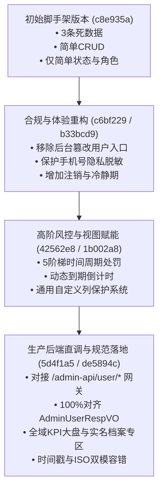

# 用户模块演进与全方位对比分析报告 (User Module Evolution)

> **版本对比范围**：从初始骨架版本（Commit `c8e935a`）到现行生产版本（Commit `de5894c`）的演进全记录。

---

## 📊 一、演进全景概览



---

## 🔍 二、核心维度全方位对比

| 对比维度 | 初始脚手架版本 (`c8e935a`) | 现行生产标准版本 (`de5894c`) | 演进价值与设计考量 |
| :--- | :--- | :--- | :--- |
| **架构与治理定位** | **传统内部管理员 CRUD**<br/>• 带有「新建用户」、「编辑资料」、「删除」按钮<br/>• 后台可直接篡改用户名/角色 | **企业级 UGC 平台合规治理**<br/>• 严格遵循用户注册与资料由客户端自主维护原则<br/>• 后台专注于合规核验、风控治理、实名追溯与封禁管控 | 杜绝管理员随意伪造/篡改用户隐私资产，满足现代合规监管要求 |
| **后端接口与通信** | **无接口层**<br/>• 纯前端内存写死 3 条伪数据数组（`initialData`）<br/>• 无分页，无真实请求 | **标准网关直调 (`/admin-api/user/*`)**<br/>• 分页：`GET /admin-api/user/users/page`<br/>• 详情：`GET /admin-api/user/users/get`<br/>• 状态：`PUT /admin-api/user/users/update-status`<br/>• 大盘：`GET /admin-api/user/statistics/summary` | 纯粹直接通信，生产/测试双分支清晰分流 |
| **数据模型与契约** | 仅 7 个字段：<br/>`id`, `username`, `email`, `role`, `status`, `createdAt` | **完全对齐 `AdminUserRespVO`**：<br/>`userId`, `phoneNumber`, `status`, `qualification`, `certified`, `initStatus`, `fanCount`, `followCount`, `friendCount`, `personalAuths`, `createTime` | 工业级强类型契约，支持精准的数据映射与校验 |
| **基础信息展示** | 简单文本，展示系统自增 `id` (如 1001) | **UID 与账号展示号独立**：<br/>• 头像、昵称、展示号 UID 聚合呈现<br/>• 支持一键复制纯净 UID<br/>• 标识「系统保底」未初始化状态 (`initStatus`) | 提升运营人员排查效率与视觉体验 |
| **隐私保护机制** | ❌ 无脱敏（明文展示邮箱） | **三级隐私保护体系**：<br/>• 手机号默认脱敏（如 `138****1234`）<br/>• 抽屉支持小眼睛 👁️/🕶️ 一键明密文切换<br/>• CSV 数据导出支持脱敏掩码与筛选导出 | 严格保障用户隐私数据安全 |
| **实名与认证体系** | ❌ 无 | **资质与实名双重核验**：<br/>• 认证类型：个人认证 (`1`)、企业蓝V (`2`)、未认证<br/>• 实名状态：`certified: true/false`<br/>• 档案专区：展示真实姓名、脱敏身份证、认证通过时间 | 满足创作者生态治理与实名制合规监管 |
| **全生命周期状态** | 仅 2 种：`active` / `disabled` | **全生命周期 3 种标准状态**：<br/>• `1` = 正常 (`normal`)<br/>• `2` = 禁用/封禁 (`banned`)<br/>• `3` = 已注销 (`cancelled`) | 贴合现代互联网产品用户注销冷静期与生命周期管理 |
| **风控惩戒系统** | ❌ 无（仅简单删除） | **多维阶梯违规惩戒体系 (`UserBanModal`)**：<br/>• 账号封禁 / 评论禁言 / 投稿禁发 / 警告 / 降权<br/>• 灵活期限（1~180天/永久/自定义）<br/>• **精确到秒的动态解封倒计时**（如 `剩 6 天 23 小时`）<br/>• 详情抽屉顶部置顶违规警示横幅与快捷处置入口 | 梯级惩戒与人性化治理，防止一刀切 |
| **社交资产呈现** | ❌ 无 | **社交关系多维监控**：<br/>• 粉丝数 (`fanCount`)、关注数 (`followCount`)、好友数 (`friendCount`)<br/>• 表格与详情抽屉指标大卡 | 全面掌握用户/达人资产规模 |
| **全局统计大盘** | ❌ 无 | **顶部 4 大全域 KPI 统计卡**：<br/>• 用户总数 + 今日新增 (`+N`)<br/>• 正常活跃账号数<br/>• 违规禁用封禁数<br/>• 已注销档案数 | 运营全局态势一目了然 |
| **搜索与多维检索** | ❌ 无任何搜索过滤功能 | **多维复合即输即查体系**：<br/>• 支持展示号、手机号、昵称、状态、认证、实名、注册时间范围<br/>• **300ms 智能防抖即输即查**，下拉/日期即时联动刷新 | 极速检索体验，大幅减少频繁点击 |
| **表格自定义列设置** | 固定死列，不可隐藏与调整 | **通用表格列设置系统 (`ColumnSetting`)**：<br/>• 核心关键列（用户信息、操作列）强制锁定保护<br/>• 次要业务列自由勾选显示/隐藏<br/>• 本地 `localStorage` 持久化记忆与一键重置 | 适配不同分辨率与不同岗位的个性化看盘需求 |
| **时间兼容性与鲁棒性** | 易因格式不一致抛出异常 | **`formatDateTime` 智能多模容错**：<br/>• 自动兼容后端毫秒数字时间戳 (Number)<br/>• 兼容 Java LocalDateTime 序列化数组<br/>• 兼容 ISO 标准字符串格式 | 杜绝 `replace is not a function` 等运行时崩溃 |

---

## 💻 三、代码实现结构变迁

### 1. 最早版本实现 (`c8e935a`，共 92 行代码)
- **代码特征**：单个文件内写死静态数组，简单的 Ant Design Table，缺少 API 抽象层与类型系统。

```tsx
// 最早版本的简单静态表格
export const UsersPage: React.FC = () => {
  const [data, setData] = useState<UserRecord[]>(initialData);
  // ... 仅支持基本的刷新和死数据展示
  return (
    <Card title="用户管理" extra={<Button type="primary">新建用户</Button>}>
      <Table dataSource={data} columns={columns} />
    </Card>
  );
};
```

---

### 2. 现行生产版本实现 (`de5894c`，模块化工业级架构)
- **代码组织**：
  - [src/types/user.ts](file:///home/panda/code/react-admin/src/types/user.ts)：完善的 Request/Response VO 接口；
  - [src/api/user.ts](file:///home/panda/code/react-admin/src/api/user.ts)：直调 `/admin-api/user/*` 的 Axios 请求层；
  - [src/api/request.ts](file:///home/panda/code/react-admin/src/api/request.ts)：JWT Bearer 鉴权与 401 静默自动续期；
  - [src/pages/Users/index.tsx](file:///home/panda/code/react-admin/src/pages/Users/index.tsx)：集成了指标大盘、防抖多维筛选、列配置保护、阶梯处置弹窗与详情档案抽屉；
  - [src/utils/time.ts](file:///home/panda/code/react-admin/src/utils/time.ts)：`formatDateTime` 与 `formatBanRemainingTime` 倒计时工具。

---

## 🎯 四、总结

从最初简单的 **“玩具型 CRUD Demo”**，用户模块历经了 10 余次迭代演进，最终沉淀为兼具 **“UGC 平台合规性”**、**“网关契约标准化”**、**“阶梯式风控精细化”** 与 **“极致交互体验”** 的企业级内容治理与用户运营中枢。
